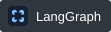
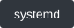
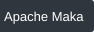
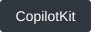
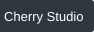

<picture>
  <source media="(prefers-color-scheme: dark)" srcset="./assets/intro-dark.svg">
  
</picture>

### Languages & Frameworks

  
  
  
  

### Infrastructure & Tools

  
  
  
  
  
  
  
  
  
  
  

### AI & Machine Learning

**Models & Training**

  
  
  
  
  

**Inference & Deployment**

  
  
  
  

### Open-source projects

<table width="100%">
  <thead>
    <tr>
      <th width="30%" align="center" valign="middle">Project</th>
      <th width="1000" align="center" valign="middle">Description</th>
    </tr>
  </thead>
  <tbody>
    <tr>
      <td align="center" valign="middle"><strong><a href="https://github.com/Totoro-qaq/dsh-plugin-bridge">dsh-plugin-bridge</a></strong></td>
      <td align="left" valign="middle">Previewable cross-preset session handoffs for DeepSeek Harness.</td>
    </tr>
    <tr>
      <td align="center" valign="middle"><strong><a href="https://github.com/Totoro-qaq/restork">restork</a></strong></td>
      <td align="left" valign="middle">A local-first desktop agent workspace with reviewable writes.</td>
    </tr>
    <tr>
      <td align="center" valign="middle"><strong><a href="https://github.com/Totoro-qaq/Cobsidian">Cobsidian</a></strong></td>
      <td align="left" valign="middle">An agent-agnostic workflow for maintaining Obsidian knowledge bases.</td>
    </tr>
  </tbody>
</table>

### Contributed to

  &#8288;
  &#8288;
  &#8288;
  &#8288;

[View all merged contributions →](https://github.com/search?q=author%3ATotoro-qaq+is%3Apr+is%3Amerged+-user%3ATotoro-qaq&type=pullrequests)

  <picture>
    <source media="(prefers-color-scheme: dark)" srcset="https://raw.githubusercontent.com/Totoro-qaq/Totoro-qaq/output/github-contribution-grid-snake-dark.svg">
    
  </picture>

[Icon credits](./assets/NOTICE.md)
